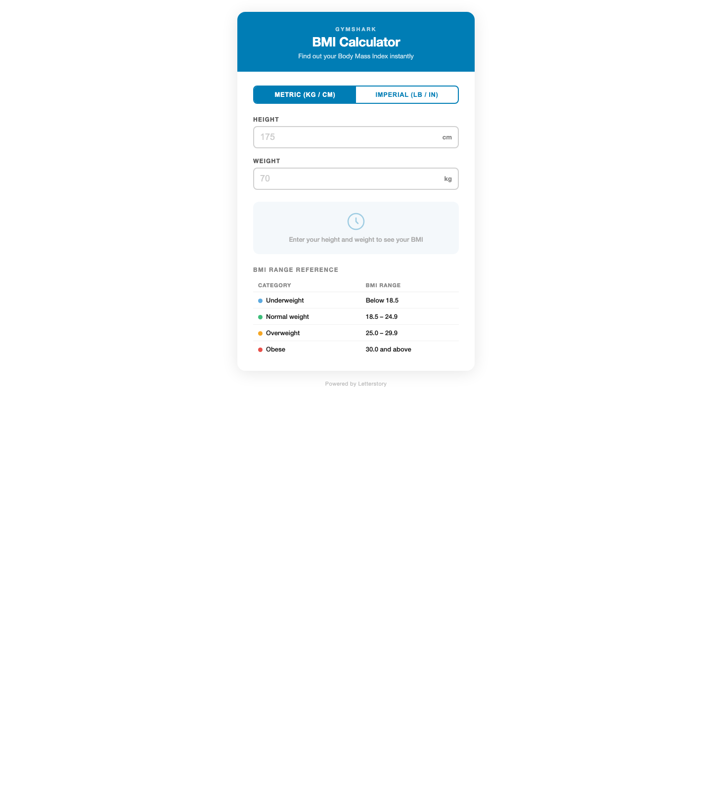
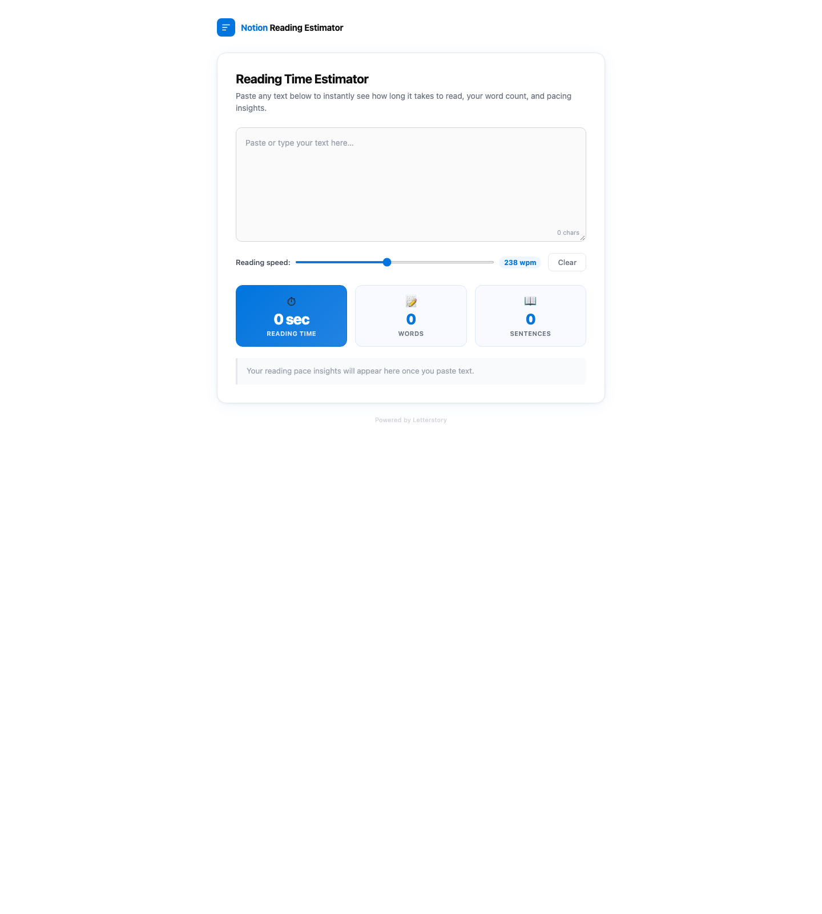
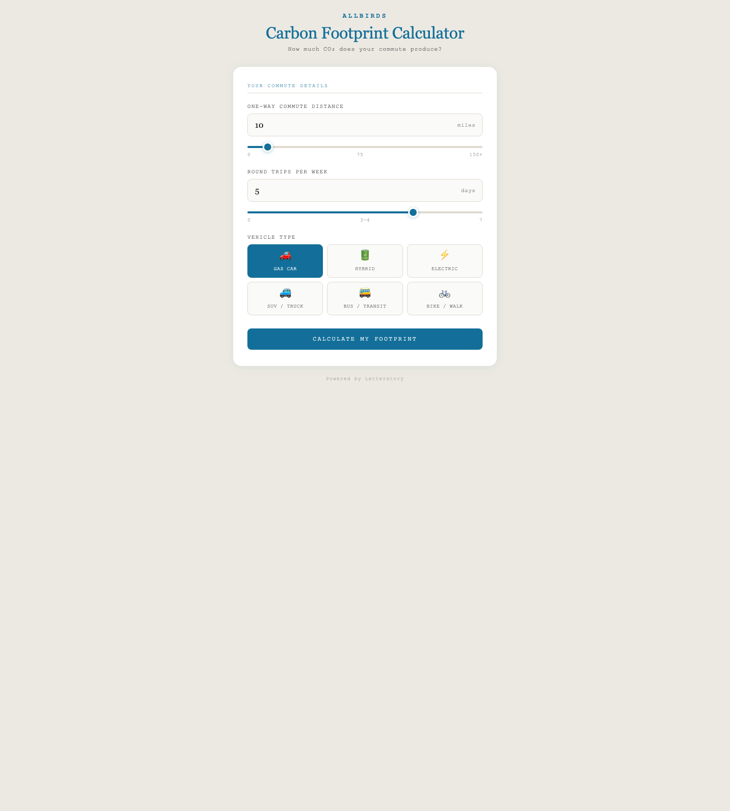
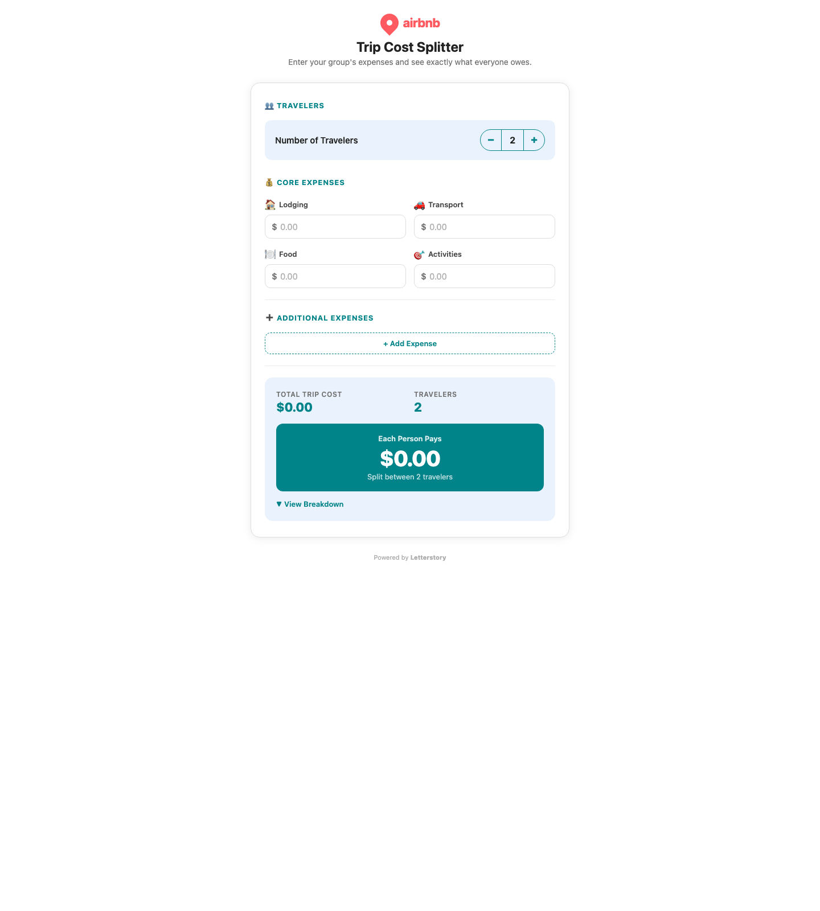
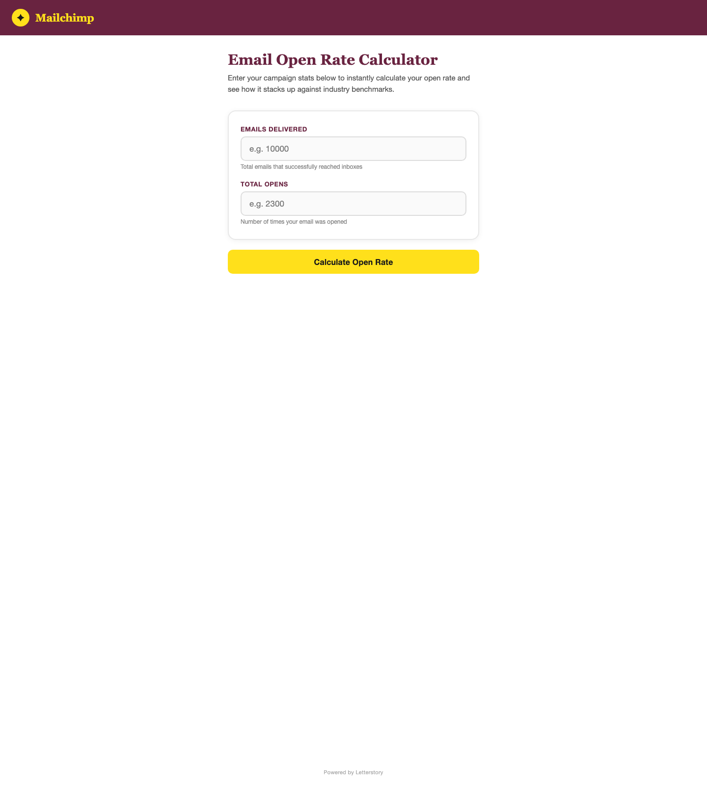

# Tool Builder Multi-Domain Verification

Date: 2026-09-04  
Production base URL: `https://web-22301-57c6c7ab-4p0z458q.onporter.run`

## What was verified

- Sequential live POSTs to `/api/tools/generate` for 6 real domains
- Extraction of generated tool ids from the JSON success payload (`tool.id`)
- HTTP-level iframe contract verification via GET `/t/{id}`
- `text/html` response type, non-trivial HTML body, and injected resize reporter markers (`letterstory-tool`, `ResizeObserver`)
- Shared embed contract invariants from `src/lib/embed/contract.ts`:
  - sandbox remains `allow-scripts allow-forms allow-popups allow-modals`
  - no `allow-same-origin`
  - listener script still guards on `event.origin` and the shared resize message source

## Firecrawl Baseline (pre-Context.dev cutover)

### Summary

6/6 domains passed the full pipeline and iframe serve contract.

Common pattern: generation and serving were consistently successful, but brand-fidelity advisories were stricter than pass/fail. Gymshark, Notion, and Allbirds all produced usable branded tools that passed the pipeline, yet the advisory check still flagged font/logo/background drift worth manual review.

### Results

| Domain | Tool Built | Gen Time | Status | iFrame Serve | Resize Script Found | Good | Bad |
|---|---|---:|---|---|---|---|---|
| gymshark.com | BMI Calculator | 83.9s | Pass | 200 text/html | Yes | Correct Gymshark palette detected; `/t/{id}` served branded HTML with resize reporter. | Brand advisory warned the font stack fell back to Arial instead of Gymshark fonts. |
| stripe.com | Payment Processing Fee Calculator | 67.9s | Pass | 200 text/html | Yes | Strong Stripe snapshot (`#533AFD`, Sohne/SF Pro Display) and clean pass on brand advisory. | No functional failures; only normal live latency. |
| notion.so | Reading Time Estimator | 66.1s | Pass | 200 text/html | Yes | Fastest successful branded run besides Stripe; Inter + blue/white palette looked plausible. | Brand advisory warned the output used a custom “N” mark and ignored one detected token, so fidelity is good-not-perfect. |
| allbirds.com | Carbon Footprint Calculator | 91.2s | Pass | 200 text/html | Yes | Domain/tool pairing felt natural; colors/fonts were pulled and embed serve succeeded. | Brand advisory warned the card background/text colors drifted toward generic white/dark defaults. |
| airbnb.com | Trip Cost Splitter | 93.8s | Pass | 200 text/html | Yes | Airbnb Cereal/Circular/Roboto snapshot and advisory both looked solid; iframe route worked cleanly. | Slowest brand-fetch stage (15.6s) of the run set, though still within budget. |
| mailchimp.com | Email Open Rate Calculator | 74.8s | Pass | 200 text/html | Yes | Good marketer/domain fit; Mailchimp yellow/plum colors and Graphik/Means Web were captured. | No failures; only routine generation time. |

### Per-domain notes

#### gymshark.com — BMI Calculator

- Result: Passed end-to-end.
- Tool id: `d8793db7-0beb-42f3-b271-a909a44458d3`
- Server-Timing: total 83.7s, brand 10.8s, build 73.0s, advisory 2.8s
- Brand snapshot looked credible: Gymshark with `#007DB5`, `#00699B`, `#C69735`, `#FFFFFF`, fonts `SN Skandia` and `Plaak Gymshark`.
- Advisory note was useful rather than blocking: palette fidelity looked good, but the generated implementation apparently fell back to Arial. This is not a pipeline failure, but it is a brand-polish gap.

#### stripe.com — Payment Processing Fee Calculator

- Result: Passed end-to-end.
- Tool id: `fae8d67d-f085-45d2-977a-6542a56eb392`
- Server-Timing: total 67.9s, brand 7.4s, build 60.5s, advisory 3.2s
- Snapshot was plausible and specific: Stripe, `#533AFD`, `#FFE0EF`, white background, fonts `Sohne` and `SF Pro Display`.
- Best overall brand-fidelity outcome in this batch: advisory passed with no notes.

#### notion.so — Reading Time Estimator

- Result: Passed end-to-end.
- Tool id: `dcc0a267-fee9-4a27-b8be-3c0f4fdef200`
- Server-Timing: total 66.1s, brand 9.9s, build 56.2s, advisory 3.6s
- Snapshot was plausible for Notion as ingested here: Inter plus a blue/white token set.
- Advisory flagged two non-blocking fidelity issues: one detected token was unused, and the logo treatment was a custom blue square with “N” instead of a more faithful Notion mark/treatment.

#### allbirds.com — Carbon Footprint Calculator

- Result: Passed end-to-end.
- Tool id: `8cd42d86-e746-4adf-968e-fa8777361d38`
- Server-Timing: total 91.2s, brand 8.8s, build 82.4s, advisory 9.6s
- Snapshot felt appropriate for Allbirds: `#E0DACF`, `#136F99`, `#1990C6`, `#ECE9E2`, fonts `Geograph` and `Akkurat Mono`.
- Advisory warning was again polish-oriented: the generated card apparently drifted to white instead of leaning into the warmer Allbirds background palette.

#### airbnb.com — Trip Cost Splitter

- Result: Passed end-to-end.
- Tool id: `8f5133e1-a37d-42e4-b645-d30679bf0b49`
- Server-Timing: total 93.8s, brand 15.6s, build 78.2s, advisory 3.0s
- Snapshot looked credible: Airbnb with `#008489`, `#EAF3FD`, `#914669`, fonts `Airbnb Cereal VF`, `Circular`, `Roboto`.
- Advisory passed with no notes. This was the slowest run overall, driven mostly by a slower brand-context phase, but still comfortably under the 300s edge budget.

#### mailchimp.com — Email Open Rate Calculator

- Result: Passed end-to-end.
- Tool id: `3834757d-adb0-4313-aa4f-82d37fb43693`
- Server-Timing: total 74.8s, brand 6.4s, build 68.3s, advisory 3.4s
- Snapshot looked strong: Mailchimp with `#FFE01B`, `#692340`, white background, fonts `Graphik Web` and `Means Web`.
- Advisory passed with no notes; this was a clean example of both branding and iframe delivery behaving as expected.

## Post-Context.dev Cutover (2026-09-04 parity retest)

### Summary

6/6 domains passed again after the Firecrawl → Context.dev cutover, and the `/t/[id]` iframe-serving contract remained intact on every generated tool (HTTP 200, `text/html`, resize reporter markers present).

Timing improved overall versus the Firecrawl baseline: total generation time dropped from 477.7s to 443.3s across the six-domain run (79.6s average → 73.9s average, 5.7s faster per domain on average). Brand fidelity was mixed-to-slightly worse overall: Notion improved, Gymshark stayed effectively the same, Stripe and Mailchimp stayed strong, but Airbnb regressed from a clean advisory pass to a logo/color mismatch warning and Allbirds still failed fidelity polish checks.

Visual proof for this same run was captured from the rendered production iframe pages and saved under `docs/screenshots/contextdev-cutover/`.

### Results

| Domain | Tool Built | Gen Time | Status | iFrame Serve | Resize Script Found | Good | Bad |
|---|---|---:|---|---|---|---|---|
| gymshark.com | BMI Calculator | 70.3s | Pass | 200 text/html | Yes | Faster than baseline (-13.6s); Gymshark palette and brand snapshot still looked correct. | Brand advisory still flagged fallback to Helvetica Neue/Arial instead of Gymshark fonts. |
| stripe.com | Payment Processing Fee Calculator | 68.9s | Pass | 200 text/html | Yes | Stripe remained a strong fidelity pass; palette and Sohne-based typography still looked on-brand. | Slightly slower than baseline (+1.0s), but no functional or fidelity regression. |
| notion.so | Reading Time Estimator | 62.3s | Pass | 200 text/html | Yes | Faster than baseline (-3.8s); Inter + blue/white styling stayed plausible, and the earlier custom-logo warning dropped away. | Advisory still noted an unused link token and text color drift (`#1a1a1a` vs `#0D0D0D`). |
| allbirds.com | Carbon Footprint Calculator | 88.4s | Pass | 200 text/html | Yes | Faster than baseline (-2.8s); warm background and primary/accent colors matched the captured snapshot better than before. | Brand advisory shifted to a typography problem: generated HTML used Georgia/Courier New instead of Geograph/Akkurat Mono. |
| airbnb.com | Trip Cost Splitter | 76.6s | Pass | 200 text/html | Yes | Largest timing win versus baseline (-17.2s); iframe contract stayed clean and brand snapshot still captured Airbnb Cereal/Circular/Roboto plus teal/plum tokens. | New fidelity regression: the rendered logo/header used legacy Airbnb red (`#FF5A5F`) instead of the captured teal/plum brand colors, so advisory moved from pass to warn. |
| mailchimp.com | Email Open Rate Calculator | 76.8s | Pass | 200 text/html | Yes | Mailchimp remained a clean fidelity pass with strong yellow/plum + Graphik/Means Web branding. | Slightly slower than baseline (+2.0s), but no functional or fidelity regression. |

### Comparison verdict vs Firecrawl baseline

- **Functional parity:** preserved. The full suite stayed at 6/6 passing and every `/t/[id]` response still met the iframe contract.
- **Timing:** improved overall. Four domains got faster, two got slightly slower, and the batch average improved by 5.7s.
- **Brand fidelity:** slightly worse overall. Improvements on Notion were offset by a new Airbnb advisory regression, while Gymshark and Allbirds still showed unresolved typography fidelity issues.

### Per-domain notes

#### gymshark.com — BMI Calculator

- Result: Passed end-to-end.
- Tool id: `756a5c34-b431-4c85-a8cb-8ffd878d4c8b`
- Server-Timing: total 70.2s, brand 8.9s, build 61.3s, advisory 3.1s
- Compared with baseline, this was materially faster while preserving the same good palette extraction.
- Brand fidelity remains effectively unchanged: colors/logo feel plausible, but the rendered tool still falls back to Helvetica Neue/Arial instead of the captured Gymshark fonts.



#### stripe.com — Payment Processing Fee Calculator

- Result: Passed end-to-end.
- Tool id: `fbce41c0-6e3c-4733-9b97-1c1e68ed91e4`
- Server-Timing: total 68.9s, brand 10.8s, build 58.1s, advisory 2.6s
- Stripe stayed a clean pass on both function and fidelity after the cutover.
- This run was ~1 second slower than baseline, but nothing in the output suggests a regression.


#### notion.so — Reading Time Estimator

- Result: Passed end-to-end.
- Tool id: `624724be-30df-42f9-817b-779b433262b9`
- Server-Timing: total 62.2s, brand 8.5s, build 53.7s, advisory 3.0s
- Notion looks modestly improved versus baseline because the prior custom “N” logo warning did not recur.
- Remaining drift is minor: one unused token and slightly darker-than-requested body text.



#### allbirds.com — Carbon Footprint Calculator

- Result: Passed end-to-end.
- Tool id: `b061879c-dc03-4a3b-8859-5d14a9af4753`
- Server-Timing: total 88.4s, brand 9.8s, build 78.6s, advisory 3.7s
- Compared with baseline, the palette/background alignment improved, but typography regressed to generic Georgia/Courier New.
- Net effect: still a brand-polish miss, just with a different failure mode than the Firecrawl-era run.



#### airbnb.com — Trip Cost Splitter

- Result: Passed end-to-end.
- Tool id: `d3b3a561-26aa-40e0-9f3b-867927b014e3`
- Server-Timing: total 76.5s, brand 9.5s, build 67.1s, advisory 3.5s
- This was much faster than baseline, but it introduced the clearest new fidelity regression in the set.
- The generated header/logo used legacy Airbnb red (`#FF5A5F`) even though the captured snapshot called for teal/plum branding, so Backend should investigate whether Context.dev ingestion or downstream prompting is biasing toward outdated Airbnb brand treatments.



#### mailchimp.com — Email Open Rate Calculator

- Result: Passed end-to-end.
- Tool id: `b7467401-e94d-401b-a5d3-c69113b78345`
- Server-Timing: total 76.7s, brand 9.4s, build 67.4s, advisory 3.4s
- Mailchimp remained a strong reference case after the cutover: fidelity passed cleanly and the iframe contract stayed healthy.
- This run was slightly slower than baseline, but the output quality remained stable.



## Harness usage

Run locally against production or another deployment:

```bash
TOOL_GENERATOR_BASE_URL="https://web-22301-57c6c7ab-4p0z458q.onporter.run" \
npm run smoke:domains -- \
  --json-out="./artifacts/tool-builder-domain-tests.json" \
  --screenshot-dir="docs/screenshots/contextdev-cutover"
```

Notes:

- The suite runs sequentially on purpose to avoid overloading generation.
- Default timeout is 330000ms and can be overridden with `TOOL_GENERATOR_TIMEOUT_MS` or `--timeout-ms=...`.
- When `--screenshot-dir` is supplied, the suite captures full-page Chromium screenshots of each `/t/[id]` page after the iframe contract checks pass.
- The script emits a JSON artifact suitable for turning into docs or CI summaries.
